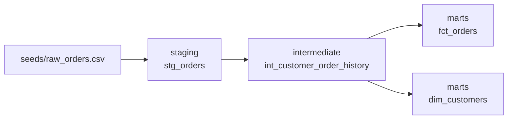

# dbt Analytics Engineering Project

A modern analytics engineering project built with dbt and DuckDB. It takes raw, denormalised order data through staging, intermediate and mart layers, with tests and auto-generated documentation at every step - and it runs entirely with the dbt CLI and a local DuckDB file, no database server or cloud account required.

## Who this is for

Anyone learning the "analytics engineering" discipline (the SQL/dbt-centric sibling of data engineering) who wants a small but complete, correctly-layered project to study or extend, and recruiters who want to see dbt modelling conventions done properly rather than a single flat SQL file.

## Why DuckDB

DuckDB is an embedded, file-based analytical database - there is no server to install or credentials to manage, so this entire project runs with `pip install dbt-duckdb` and a single command. The SQL and dbt patterns shown here transfer directly to Snowflake, BigQuery, Postgres or Redshift in a real job.

## Layered model architecture



- **Staging** (`models/staging`) - one-to-one with the source, renames/casts columns, applies light filtering. Never joins across sources.
- **Intermediate** (`models/intermediate`) - reusable business logic (e.g. per-customer order history and lifetime metrics) that multiple marts can build on, kept out of the final marts to avoid duplication.
- **Marts** (`models/marts`) - the final, business-facing tables analysts and BI tools query: a orders fact table and a customers dimension table.

## Project structure

```text
dbt-analytics-engineering-project/
├── dbt_project.yml
├── profiles.yml                 # DuckDB connection profile (local file, no server)
├── seeds/
│   └── raw_orders.csv            # sample raw order data loaded via 'dbt seed'
└── models/
    ├── staging/stg_orders.sql
    ├── intermediate/int_customer_order_history.sql
    ├── marts/fct_orders.sql
    ├── marts/dim_customers.sql
    └── schema.yml                 # sources, column tests, descriptions
```

## Getting started

```bash
git clone https://github.com/Kornelius99/dbt-analytics-engineering-project.git
cd dbt-analytics-engineering-project
pip install dbt-duckdb

dbt seed --profiles-dir .          # loads seeds/raw_orders.csv into DuckDB
dbt run --profiles-dir .           # builds staging -> intermediate -> marts
dbt test --profiles-dir .          # runs not_null/unique/relationship tests
dbt docs generate --profiles-dir . && dbt docs serve   # browsable data catalog + lineage graph
```

## What this project demonstrates

The staging/intermediate/marts layering convention, dbt sources and seeds, column- and model-level testing, auto-generated documentation and lineage graphs, and writing SQL that is modular and reusable rather than one giant query.

## Extending this project

- Add `dbt_utils` package tests (e.g. `accepted_range`, `not_constant`) for more advanced data quality coverage.
- Add an incremental model to practice `is_incremental()` logic instead of full-refresh tables.
- Point `profiles.yml` at Postgres/Snowflake/BigQuery to see the exact same models run against a real warehouse.

## License

MIT - see [LICENSE](LICENSE). Free to use, fork, and adapt for your own learning or portfolio.
